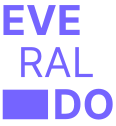

### 🎃 @evvvrado

 

<!-- ### Oque eu faço ? -->

#### < Desenvolvedor Front-end, Design Engineer e Creative Developer Student />

 No desenvolvimento web enxergo um horizonte de possibilidades criativas, amo pensar na <strong>ARTE</strong> de fazer aplicações que criam experiências únicas para seus usuários. 

-   [React.js](https://pt-br.reactjs.org) - [Next.js](https://nextjs.org) - [Node.js](https://nodejs.org/en/) - [TypeScript](https://www.typescriptlang.org) - [SASS/SCSS](https://sass-lang.com) - [GSAP](https://greensock.com/gsap/) - [Framer Motion](framer.com/motion/)

<!-- ## -->
